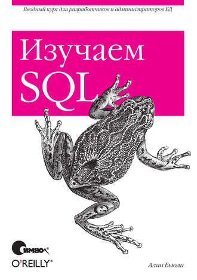

# Рекомендуемая литература:

1.  Дейт К.Дж. Введение в системы баз данных

2.  Бьюли А. Изучаем SQL

3.  http://citforum.ru/database/

4.  https://dev.mysql.com/doc/

# Необходимые инструменты:

1.  MySQL Workbench https://dev.mysql.com/downloads/workbench/

2.  https://www.draw.io/

# Темы лабораторных работ:

1.  Проектирование базы данных. Описание предметной области,
    концептуальная, логическая модель базы данных.
    Нормализация.

2.  Физическая модель базы данных. Формулировка запросов к базе даных.

3.  Язык SQL. Создание таблиц. Оператор CREATE. Оптимизация используемых
    типов даных. Типы данных MySQL.

4.  Язык SQL. Выборка данных с использованием операторов Select. Where.
    Агрегаторы. Group By. Having. Order By.

5.  Язык SQL. Операторы Insert. Update. Delete. Условная логика IF,
    CASE.

6.  Язык SQL. Подзапросы. Несвязанные подзапросы. Связанные подзапросы.
    Размерность подзапроса.

7.  Язык SQL. Объединения.

8.  Оптимизация. Подсистемы хранения. Индексы. Explain. Типы индексов
    MySQL.

9.  Базы данных дополнительные возможности. View. Тригеры. Хранимые
    процедуры.

10. Защита данных. Транзакции. Уровни изоляции. Взаимные блокировки.
    Ручные блокировки.

11. Администрирование баз данных. Системные таблицы. Переменные
    окружения. Права доступа пользователям. Логирование.

12. Клиент-серверная архитектура. ORM. Hibernate.
